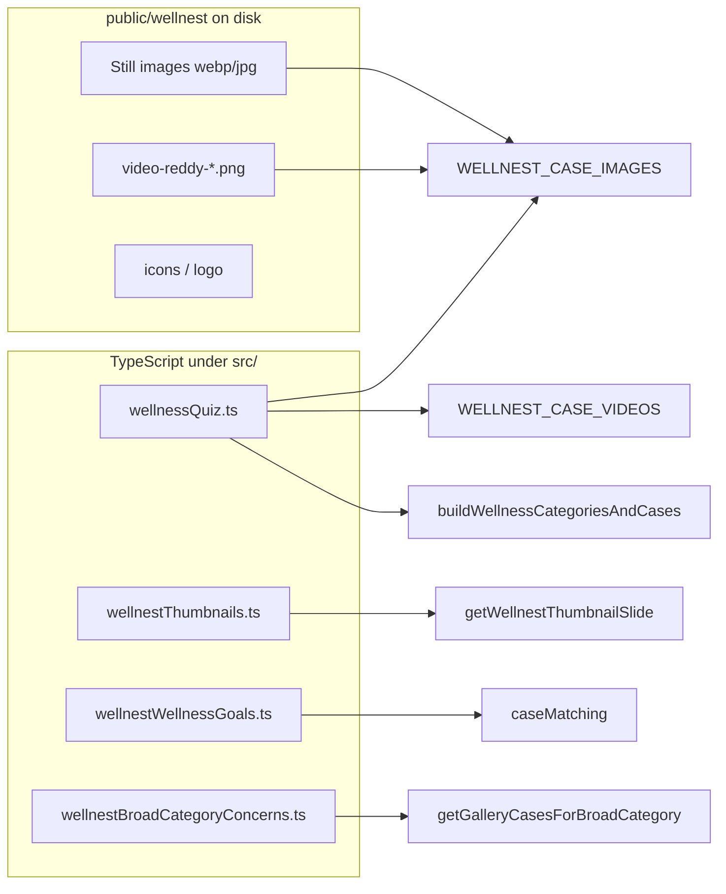

# Wellness & Wellnest reference (skin-type-react)

Use this document in another Cursor project or repo. It describes **where images live**, **which TypeScript modules own the data**, and **how keys map together** for the peptide/wellness quiz, results cards, and Dr. Reddy video thumbnails.

## Repository root (absolute)

All file paths below are under this directory:

```
/Users/sambrause/Documents/GitHub/ponce-cases-staging/skin-type-react/skin-type-react
```

**This document on disk:**

`/Users/sambrause/Documents/GitHub/ponce-cases-staging/skin-type-react/skin-type-react/docs/WELLNESS_WELLNEST_REFERENCE.md`

**Companion manifest (every wellness-related file listed):**

`/Users/sambrause/Documents/GitHub/ponce-cases-staging/skin-type-react/skin-type-react/docs/WELLNESS_WELLNEST_ABSOLUTE_PATHS.md`

**Dr. Reddy thumbnails — step-by-step recreation (PNG export, Canva, HTML tools, full slide table):**

`/Users/sambrause/Documents/GitHub/ponce-cases-staging/skin-type-react/skin-type-react/docs/WELLNEST_DR_REDDY_THUMBNAIL_RECREATION_GUIDE.md`

---

## What to copy into another project

| What | Absolute path(s) |
|------|------------------|
| Static assets (whole tree) | `/Users/sambrause/Documents/GitHub/ponce-cases-staging/skin-type-react/skin-type-react/public/wellnest/` |
| Dr. Reddy thumbnail PNGs (expected; may be generated) | `/Users/sambrause/Documents/GitHub/ponce-cases-staging/skin-type-react/skin-type-react/public/wellnest/thumbnails/video-reddy-1.png` through `video-reddy-16.png` |
| Thumbnail generator tool | `/Users/sambrause/Documents/GitHub/ponce-cases-staging/skin-type-react/skin-type-react/public/wellnest/thumbnail-generator.html` |
| Thumbnail README | `/Users/sambrause/Documents/GitHub/ponce-cases-staging/skin-type-react/skin-type-react/public/wellnest/thumbnails/README.md` |
| Core data & mappings | `/Users/sambrause/Documents/GitHub/ponce-cases-staging/skin-type-react/skin-type-react/src/data/wellnessQuiz.ts` |
| Live thumbnail layouts | `/Users/sambrause/Documents/GitHub/ponce-cases-staging/skin-type-react/skin-type-react/src/data/wellnestThumbnails.ts` |
| Sample / fallback cases | `/Users/sambrause/Documents/GitHub/ponce-cases-staging/skin-type-react/skin-type-react/src/data/wellnestSampleCases.ts` |
| Onboarding “concerns” | `/Users/sambrause/Documents/GitHub/ponce-cases-staging/skin-type-react/skin-type-react/src/constants/wellnestWellnessGoals.ts` |
| Gallery ↔ category merge | `/Users/sambrause/Documents/GitHub/ponce-cases-staging/skin-type-react/skin-type-react/src/constants/wellnestBroadCategoryConcerns.ts` |
| Photos filter (peptide indications) | `/Users/sambrause/Documents/GitHub/ponce-cases-staging/skin-type-react/skin-type-react/src/config/wellnestPeptideOfferings.ts` |
| Matching logic | `/Users/sambrause/Documents/GitHub/ponce-cases-staging/skin-type-react/skin-type-react/src/utils/caseMatching.ts` |
| Wellnest thumbnail component | `/Users/sambrause/Documents/GitHub/ponce-cases-staging/skin-type-react/skin-type-react/src/components/WellnestThumbnail.tsx` |
| Results UI (Wellnest cards / drill-in) | `/Users/sambrause/Documents/GitHub/ponce-cases-staging/skin-type-react/skin-type-react/src/components/screens/ResultsScreen.tsx` |
| App wiring (filtering, practice) | `/Users/sambrause/Documents/GitHub/ponce-cases-staging/skin-type-react/skin-type-react/src/App.tsx` |
| Routes | `/Users/sambrause/Documents/GitHub/ponce-cases-staging/skin-type-react/skin-type-react/src/main.tsx` |
| Types | `/Users/sambrause/Documents/GitHub/ponce-cases-staging/skin-type-react/skin-type-react/src/types/index.ts` |
| Form steps / concerns by practice | `/Users/sambrause/Documents/GitHub/ponce-cases-staging/skin-type-react/skin-type-react/src/constants/data.ts` |
| Styles (search inside for `wellnest`) | `/Users/sambrause/Documents/GitHub/ponce-cases-staging/skin-type-react/skin-type-react/src/App.css` |

Other related files (quiz UI, onboarding, leads): full list in  
`/Users/sambrause/Documents/GitHub/ponce-cases-staging/skin-type-react/skin-type-react/docs/WELLNESS_WELLNEST_ABSOLUTE_PATHS.md`.

---

## URL base (browser) vs files on disk

The app serves `public/` at `/`. Examples:

| URL (in browser) | Absolute file path |
|------------------|-------------------|
| `/wellnest/Eric-Ouollette-1-1.webp` | `/Users/sambrause/Documents/GitHub/ponce-cases-staging/skin-type-react/skin-type-react/public/wellnest/Eric-Ouollette-1-1.webp` |
| `/wellnest/thumbnails/video-reddy-1.png` | `/Users/sambrause/Documents/GitHub/ponce-cases-staging/skin-type-react/skin-type-react/public/wellnest/thumbnails/video-reddy-1.png` |
| `/wellnest/Dr-Reddy-qr-code.png` | `/Users/sambrause/Documents/GitHub/ponce-cases-staging/skin-type-react/skin-type-react/public/wellnest/Dr-Reddy-qr-code.png` |

Registries `WELLNEST_CASE_IMAGES` and `WELLNEST_CASE_VIDEOS` are defined in:

`/Users/sambrause/Documents/GitHub/ponce-cases-staging/skin-type-react/skin-type-react/src/data/wellnessQuiz.ts`

---

## Image key registry (`WELLNEST_CASE_IMAGES`)

**Defined in:** `/Users/sambrause/Documents/GitHub/ponce-cases-staging/skin-type-react/skin-type-react/src/data/wellnessQuiz.ts`

Keys are **logical ids** used by `WELLNESS_TREATMENT_IMAGE`, `WELLNEST_EXTRA_CASES`, and `CaseItem.imageKey` for live-rendered thumbs.

| Key group | Keys | Role |
|-----------|------|------|
| Muscle stills | `muscle1` … `muscle7` | Before/after–style assets for muscle/recovery treatments + one extra story case |
| Bone/joint | `bone1`, `bone2` | MK-677, Cartalax |
| Weight | `weight1` … `weight5` | Metabolism / weight treatments + extras |
| Skin | `skin1` … `skin5` | Skin peptide treatments + one extra |
| Brain (reuse skin art) | `brain1` … `brain4` | Cognitive treatments (visual reuse) |
| YouTube Shorts (legacy) | `video-anxiety`, `video-muscle`, `video-weight` | Thumbnail URLs point to `img.youtube.com` |
| Dr. Reddy | `video-reddy-1` … `video-reddy-16` | PNGs under `public/wellnest/thumbnails/` + Vimeo URLs in `WELLNEST_CASE_VIDEOS` |

Exact strings change over time; **trust `WELLNEST_CASE_IMAGES` in** `/Users/sambrause/Documents/GitHub/ponce-cases-staging/skin-type-react/skin-type-react/src/data/wellnessQuiz.ts` as the source of truth.

---

## Video registry (`WELLNEST_CASE_VIDEOS`)

**Same file:** `/Users/sambrause/Documents/GitHub/ponce-cases-staging/skin-type-react/skin-type-react/src/data/wellnessQuiz.ts`

Maps image keys → playback URL (YouTube Shorts or Vimeo). Comments in that file list human-readable titles (e.g. “What are peptides — Start here” for `video-reddy-1`).

---

## Treatment → image key (`WELLNESS_TREATMENT_IMAGE`)

Maps **wellness treatment id** (from `WELLNESS_TREATMENTS` in `wellnessQuiz.ts`) to a key in `WELLNEST_CASE_IMAGES`:

| Treatment id | Image key |
|--------------|-----------|
| `bpc-157` | muscle1 |
| `tb-500` | muscle2 |
| `cjc-1295` | muscle3 |
| `ipamorelin` | muscle4 |
| `ghrp-2-6` | muscle5 |
| `igf-1-lr3` | muscle6 |
| `mk-677` | bone1 |
| `cartalax` | bone2 |
| `tessamorelin` | weight1 |
| `aod-9604` | weight2 |
| `ghk-cu` | skin1 |
| `melanotan-2` | skin2 |
| `sermorelin` | skin3 |
| `epitalon` | skin4 |
| `semax` | brain1 |
| `selank` | brain2 |
| `p21` | brain3 |
| `pinealon` | brain4 |

---

## Broad result categories (results UI)

**Display names and ids** live in `/Users/sambrause/Documents/GitHub/ponce-cases-staging/skin-type-react/skin-type-react/src/data/wellnessQuiz.ts` (`WELLNESS_BROAD_CATEGORIES`, `WELLNESS_TREATMENT_TO_BROAD_CATEGORY`, `buildWellnessCategoriesAndCases`).

| Broad category `id` | Display name | Pillar |
|---------------------|--------------|--------|
| `muscle-recovery` | Muscle and recovery | wellness |
| `weight-metabolism` | Weight and metabolism | wellness |
| `bone-joint` | Bone and joint | wellness |
| `brain-mood` | Brain and mood | wellness |
| `general-wellness` | Peptide education | wellness |
| `skin-anti-aging` | Skin and anti-aging | aesthetic |

---

## Extra synthetic cases (`WELLNEST_EXTRA_CASES`)

**In:** `/Users/sambrause/Documents/GitHub/ponce-cases-staging/skin-type-react/skin-type-react/src/data/wellnessQuiz.ts`

Each row: `categoryId`, `imageKey`, `headline`, `story`.

- **Video rows** (with `WELLNEST_CASE_VIDEOS[imageKey]`): prepended to that category’s case list.
- **Photo-only rows**: appended only if the category already exists.
- Dr. Reddy entries use `imageKey` `video-reddy-1` … `video-reddy-16` and mostly `general-wellness`, `muscle-recovery`, `weight-metabolism`, `skin-anti-aging`, or `brain-mood`.

---

## Live Dr. Reddy thumbnails (canvas-style)

**File:** `/Users/sambrause/Documents/GitHub/ponce-cases-staging/skin-type-react/skin-type-react/src/data/wellnestThumbnails.ts`

- **`WELLNEST_THUMBNAIL_SLIDES`**: 16 entries, index `n` ↔ `video-reddy-{n+1}`.
- **`getWellnestThumbnailSlide(imageKey)`**: returns layout config or `null` for non–`video-reddy-*` keys.
- **`WELLNEST_DR_REDDY_IMAGE`**: resolves to file `/Users/sambrause/Documents/GitHub/ponce-cases-staging/skin-type-react/skin-type-react/public/wellnest/Dr-Reddy-qr-code.png`
- **`WELLNEST_VIAL_IMAGES`**: files under `/Users/sambrause/Documents/GitHub/ponce-cases-staging/skin-type-react/skin-type-react/public/wellnest/thumbnails/vials/` (`vial-1.png`, `vial-2.png`, `vial-3.png`)

**Consumer component:** `/Users/sambrause/Documents/GitHub/ponce-cases-staging/skin-type-react/skin-type-react/src/components/WellnestThumbnail.tsx`

---

## Wellnest display copy (regulatory / no compound names)

**All in:** `/Users/sambrause/Documents/GitHub/ponce-cases-staging/skin-type-react/skin-type-react/src/data/wellnessQuiz.ts`

| Export / data | Purpose |
|---------------|---------|
| `WELLNEST_DISPLAY_NAMES` | Indication-only labels per treatment id for Wellnest. |
| `WELLNESS_PATIENT_STORIES` | First-person headline + story for results cards. |
| `getWellnessQuizResultsSMSMessage` | SMS text from quiz suggested ids. |

---

## Wellness goals vs Photos gallery merge

- **Goals & keywords:** `/Users/sambrause/Documents/GitHub/ponce-cases-staging/skin-type-react/skin-type-react/src/constants/wellnestWellnessGoals.ts` (`WELLNEST_WELLNESS_GOALS`, `mapsToPhotos`)

- **Broad category → concern ids:** `/Users/sambrause/Documents/GitHub/ponce-cases-staging/skin-type-react/skin-type-react/src/constants/wellnestBroadCategoryConcerns.ts` (`WELLNEST_BROAD_CATEGORY_TO_CONCERN_IDS`, `getGalleryCasesForBroadCategory`)

---

## SVG / misc icons

Directory:

`/Users/sambrause/Documents/GitHub/ponce-cases-staging/skin-type-react/skin-type-react/public/wellnest/`

Examples: `icon-energy.svg`, `icon-sleep.svg`, `icon-brain.svg`, `icon-gut.svg`, `icon-joint.svg`, `nav-logo-5.svg` — each file’s full path is  
`/Users/sambrause/Documents/GitHub/ponce-cases-staging/skin-type-react/skin-type-react/public/wellnest/<filename>`.

---

## Optional tools & briefs (absolute)

- `/Users/sambrause/Documents/GitHub/ponce-cases-staging/skin-type-react/skin-type-react/public/wellnest/thumbnail-generator.html`
- `/Users/sambrause/Documents/GitHub/ponce-cases-staging/skin-type-react/skin-type-react/public/wellnest/thumbnail-editor.html`
- `/Users/sambrause/Documents/GitHub/ponce-cases-staging/skin-type-react/skin-type-react/public/wellnest/thumbnails/CANVA-AI-PROMPTS.md`
- `/Users/sambrause/Documents/GitHub/ponce-cases-staging/skin-type-react/skin-type-react/public/wellnest/thumbnails/CANVA-BRIEF.md`
- `/Users/sambrause/Documents/GitHub/ponce-cases-staging/skin-type-react/skin-type-react/public/wellnest/thumbnails/thumbnail-copy.csv`

---

## Flow (high level)



(Resolve each node to the **absolute paths** in the tables above.)

---

## Copy entire asset tree (example)

```bash
cp -R "/Users/sambrause/Documents/GitHub/ponce-cases-staging/skin-type-react/skin-type-react/public/wellnest" "/path/to/other-project/public/"
```

---

## Cursor tip

Copy this file to the other repo (paths stay valid if both clones use the same parent path). If your clone lives elsewhere, replace only the prefix  
`/Users/sambrause/Documents/GitHub/ponce-cases-staging/skin-type-react/skin-type-react`  
with your local root.

Last aligned to repo: **skin-type-react** (Wellnest peptide flow). If you add treatments or image keys, update `/Users/sambrause/Documents/GitHub/ponce-cases-staging/skin-type-react/skin-type-react/src/data/wellnessQuiz.ts` first, then refresh this doc.
